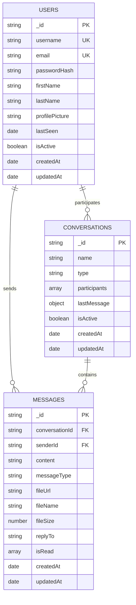

# MongoDB Schema Visual Representation

## Entity Relationship Diagram

## Collection Relationships

### Users Collection
- Stores user account information
- Each user can participate in multiple conversations
- Each user can send multiple messages

### Conversations Collection
- Contains conversation metadata
- Embedded participants array to store users in the conversation
- References to the last message sent in the conversation
- Supports both direct (1:1) and group conversations

### Messages Collection
- Contains individual message documents
- References to conversation and sender
- Tracks read receipts for each user
- Supports different message types (text, media, etc.)

## Key Features

1. **Flexible Schema**: MongoDB's document model allows for flexible message types and conversation structures
2. **Efficient Queries**: Proper indexing enables fast retrieval of conversations and messages
3. **Scalability**: Designed to handle large volumes of messages and concurrent users
4. **Real-time Ready**: Schema supports real-time messaging features like read receipts and last message tracking

## Implementation Notes

- Use ObjectId for all primary keys
- Implement proper validation on content fields
- Set up indexes as described in the documentation
- Consider using MongoDB's change streams for real-time updates
- Implement proper security measures to validate user access to conversations